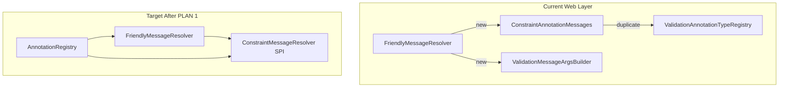
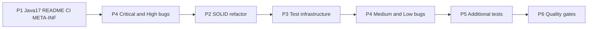

# PLAN 1 — Core Refactor & Quality (Group 1)

**Project:** Spring Validator (`id.xtramile:spring-validator`)  
**Version line:** **1.x** (no major version bump in this plan)  
**Prerequisite:** None — execute this plan first.  
**Followed by:** [PLAN_2.md](PLAN_2.md) (multi-module + Spring Boot 4)  
**Goal:** Single-module library that is SOLID-compliant, Java 17+ aligned, well-tested, and quality-gated (Checkstyle, Javadoc, JaCoCo).

---

## Current State

| Area               | Status                                                                                                             |
|--------------------|--------------------------------------------------------------------------------------------------------------------|
| Production classes | 158 files in `src/main/java` (`annotation/`, `validator/`, `web/`, `autoconfigure/`, `util/`, `config/`, `enums/`) |
| Test classes       | ~106 files in `src/test/java` mirroring production packages                                                        |
| Java target        | **Java 17** (`maven.compiler.release=17`, enforcer `[17,)`)                                                         |
| Spring Boot        | **3.5.14** via `spring-boot-dependencies` BOM (`spring-boot.version` property)                                     |
| CI                 | **Consolidated** — `ci.yml` (primary), `build.yml` (cross-OS); Java 17/21/25 only                                    |
| Documentation      | **`README.md`** created                                                                                            |
| Code quality       | No Checkstyle, no JaCoCo enforcement, Javadoc plugin attaches JAR only                                             |
| SOLID debt         | **Resolved** — DIP wiring, `AnnotationRegistry`, message strategies in `web/messages/`                             |
| Auto-config        | **Fixed** — `META-INF/spring/org.springframework.boot.autoconfigure.AutoConfiguration.imports`                       |
| Logging            | **`slf4j-api` optional** added; `System.out.println` removed from web layer                                        |



---

## Phase Numbering vs Execution Order

Phases are **numbered 1–6 for documentation**. **Execution order differs** where early fixes reduce refactor risk:



| Execution step | Phase doc           | What runs                                                |
|----------------|---------------------|----------------------------------------------------------|
| 1              | Phase 1             | Java 17, BOM, CI consolidation, README, **META-INF fix** |
| 2              | Phase 4 (subset)    | **Critical + High** bugs only (NPE, null target)         |
| 3              | Phase 2             | SOLID refactor (DIP → registry → split messages)         |
| 4              | Phase 3             | Test support package                                     |
| 5              | Phase 4 (remainder) | Medium + Low bugs                                        |
| 6              | Phase 5             | New tests                                                |
| 7              | Phase 6             | Checkstyle, Javadoc, JaCoCo, SpotBugs                    |

---

## Phase 1: Java 17+ Alignment ✅ COMPLETE

**Objective:** Establish Java 17 as minimum; parameterize Spring Boot 3.5.x via BOM; fix auto-config path; create docs; consolidate CI.

**Completed:** 2026-06-12 — all tasks 1.1–1.12 done; `mvn clean test` passes (1478 tests) on JDK 17/21.

### Tasks

| #    | Task                                                                               | File(s)                   |
|------|------------------------------------------------------------------------------------|---------------------------|
| 1.1  | Set `maven.compiler.release` to `17`                                               | `pom.xml`                 |
| 1.2  | Add `maven-compiler-plugin` (3.13.x) explicitly                                    | `pom.xml`                 |
| 1.3  | Add `maven-enforcer-plugin` with `requireJavaVersion` `[17,)`                      | `pom.xml`                 |
| 1.4  | Add property `spring-boot.version` default `3.5.14`                                | `pom.xml`                 |
| 1.5  | Import `spring-boot-dependencies` BOM; remove hardcoded versions from dependencies | `pom.xml`                 |
| 1.6  | Add `emailvalidator.version` property (`1.0.1`) in `dependencyManagement`          | `pom.xml`                 |
| 1.7  | Remove Java 11 from all CI matrices                                                | `.github/workflows/*.yml` |
| 1.8  | CI matrix: Java `[17, 21, 25]` with Spring Boot `3.5.14` only                      | `.github/workflows/*.yml` |
| 1.9  | **Fix META-INF auto-config path** (see below)                                      | `src/main/resources/`     |
| 1.10 | **Consolidate CI workflows** (see below)                                           | `.github/workflows/`      |
| 1.11 | **Create `README.md`** (see below)                                                 | `README.md`               |
| 1.12 | Add enforcer `banDependency` — `src/main` must not depend on test artifacts        | `pom.xml`                 |

### 1.9 META-INF auto-config fix (moved from Phase 4 — execute in Phase 1)

**Problem:** File lives at `src/main/resources/META-INF.spring/org.springframework.boot.autoconfigure.AutoConfiguration.imports` (wrong folder).

**Fix:**
1. Create directory `src/main/resources/META-INF/spring/`
2. Move file to `src/main/resources/META-INF/spring/org.springframework.boot.autoconfigure.AutoConfiguration.imports`
3. Delete empty `META-INF.spring/` directory
4. Verify with `@SpringBootTest(classes = ValidationAutoConfiguration.class)` — bean `ValidationAutoConfiguration` must load

### 1.10 CI workflow consolidation

**Problem:** Three overlapping workflows: `ci.yml`, `build.yml`, `test-multi-java.yml`.

**Target layout:**

| Workflow              | Purpose                                                                | Matrix                                                      |
|-----------------------|------------------------------------------------------------------------|-------------------------------------------------------------|
| `ci.yml`              | **Primary** — test + quality gates on push/PR                          | Java 17, 21, 25 × Boot 3.5.14; quality jobs on Java 17 only |
| `build.yml`           | **Optional** — cross-OS smoke (ubuntu, windows, macos) on Java 17 only | OS × Java 17; run `mvn clean test` (not full verify)        |
| `test-multi-java.yml` | **Remove or merge** into `ci.yml`                                      | Eliminate duplication                                       |

**CI rules:**
- `mvn clean verify` on `ci.yml` (includes tests; quality gates added in Phase 6)
- **GPG sign** (`maven-gpg-plugin`) — **not** run in CI; release/manual only
- Upload Surefire reports + JaCoCo HTML (Phase 6) as artifacts

### 1.11 Create README.md

Repo has no README. Create with:

1. **Project description** — Indonesian-friendly Jakarta Bean Validation library for Spring
2. **Requirements** — Java 17+, Spring Boot 3.5.x (Boot 4 in PLAN 2)
3. **Installation** — Maven dependency (`id.xtramile:spring-validator:1.x`)
4. **Quick start** — annotation example + `id.xtramile.validator.enabled` property
5. **Configuration** — `id.xtramile.validator.locale` (`id` default)
6. **Quality commands** — `checkstyle:check`, `javadoc:javadoc`, `jacoco:report`, `verify`, `-Pquick`
7. **Link** to `CONTRIBUTING.md` (Phase 6)

### 1.12 Enforcer rules

```xml
<plugin>
    <artifactId>maven-enforcer-plugin</artifactId>
    <executions>
        <execution>
            <id>enforce</id>
            <goals><goal>enforce</goal></goals>
            <configuration>
                <rules>
                    <requireJavaVersion><version>[17,)</version></requireJavaVersion>
                    <banDependency>
                        <excludes>
                            <exclude>*:*:jar:test-jar</exclude>
                        </excludes>
                        <searchTransitive>true</searchTransitive>
                    </banDependency>
                </rules>
            </configuration>
        </execution>
    </executions>
</plugin>
```

Tune `banDependency` so test-scoped test-jars in `src/test` remain allowed.

### `pom.xml` properties (target)

```xml
<properties>
    <java.version>17</java.version>
    <maven.compiler.release>17</maven.compiler.release>
    <spring-boot.version>3.5.14</spring-boot.version>
    <emailvalidator.version>1.0.1</emailvalidator.version>
    <project.build.sourceEncoding>UTF-8</project.build.sourceEncoding>
</properties>
```

### Verification

```bash
mvn clean test -Dspring-boot.version=3.5.14
# Run on JDK 17, 21, and 25
# Confirm ValidationAutoConfiguration loads in SpringBootTest
```

### Success criteria

- [x] Build fails on JDK 11 (enforcer)
- [x] Build passes on JDK 17, 21, 25
- [x] No hardcoded Spring Boot version strings in `<dependency>` blocks
- [x] `META-INF/spring/AutoConfiguration.imports` exists at correct path
- [x] `README.md` created
- [x] Single primary CI workflow (`ci.yml`); no duplicate Java 11 jobs

---

## Phase 2: SOLID Refactoring (Production Code) ✅ COMPLETE

**Objective:** Decouple web message layer; enforce single registry; inject dependencies via Spring.

**Prerequisite (execution order):** Complete **Phase 4 Critical + High** bugs before **Phase 2b** (message class split). DIP wiring (2a) may proceed after Phase 1 META-INF fix.

**Execute incrementally:** 2a → 2e → 2c → **(Phase 4 High NPE fixes)** → 2b → 2d

**Completed:** 2026-06-12 — 2a–2e and 2d done; 2f doc deferred to Phase 6 `CONTRIBUTING.md`.

### 2a. Dependency Inversion — inject collaborators

**Problem:** [`FriendlyMessageResolver`](src/main/java/id/xtramile/validator/web/FriendlyMessageResolver.java) constructs its own dependencies (violates DIP).

**Changes:**

1. Add constructor accepting `MessageResourceResolver`, `ValidationFieldDisplayNames`, `ValidationMessageArgsBuilder`, and `ConstraintAnnotationMessages` (or `CompositeConstraintMessageResolver` after 2b).
2. Wire beans in [`ValidationAutoConfiguration`](src/main/java/id/xtramile/validator/autoconfigure/ValidationAutoConfiguration.java) with `@ConditionalOnMissingBean`.
3. Keep convenience single-arg constructor delegating to defaults for manual/test use.

### 2b. Single Responsibility — split `ConstraintAnnotationMessages`

**Prerequisite:** High-severity NPE fixes in `ConstraintAnnotationMessages` (Phase 4) applied **before** splitting this class.

**Target classes:**

| Class                                | Responsibility                                  |
|--------------------------------------|-------------------------------------------------|
| `ConstraintMessageResolver`          | Interface: `supports(Class<?>)`, `resolve(...)` |
| `SpringBuiltinConstraintMessages`    | `NotBlank`, `Size`, `Min`, `Max`, etc.          |
| `CommonConstraintMessages`           | `InWhitelist`, `ValidEnum`, etc.                |
| `DataConstraintMessages`             | `ValidPassword`, `ValidUsername`, etc.          |
| `DateTimeConstraintMessages`         | `ValidDate`, `ValidPastDate`, etc.              |
| `FileConstraintMessages`             | `ValidFileSize`, etc.                           |
| `FinanceConstraintMessages`          | `ValidIBAN`, etc.                               |
| `ContactConstraintMessages`          | `ValidEmail`, etc.                              |
| `CrossConstraintMessages`            | `FieldMatch`, etc.                              |
| `LocationConstraintMessages`         | `ValidPostalCode`, etc.                         |
| `NetworkConstraintMessages`          | `ValidURL`, etc.                                |
| `KycConstraintMessages`              | `ValidIDImage`, etc.                            |
| `CompositeConstraintMessageResolver` | Delegates to registered strategies              |

`FriendlyMessageResolver` depends only on `CompositeConstraintMessageResolver`.

### 2c. Open/Closed — unify the triple registry

**Problem:** Three files must stay synchronized when adding a validator.

**Changes:**

1. Create `AnnotationRegistry` — single map: annotation class → `{ simpleName, messageGroup, argBuilder }`.
2. `ValidationAnnotationTypeRegistry.resolve(String)` delegates to `AnnotationRegistry`.
3. Message resolvers and arg builder read from the same registry.
4. **Do not add `AnnotationRegistryCompletenessTest` here** — that test is owned by **Phase 5** (after registry is stable).

### 2d. DRY in validators (scoped, lower priority)

Extract shared datetime parsing/tolerance logic into package-private `DateToleranceEvaluator` in `validator/datetime/support/` — only where duplication exceeds ~30 identical lines.

### 2e. Remove production debug noise — logging strategy

**Decision:** Use **`slf4j-api` only** (no binding). Consumers (Spring Boot) provide Logback.

| Item                        | Action                                                                                                                         |
|-----------------------------|--------------------------------------------------------------------------------------------------------------------------------|
| Remove `System.out.println` | `FriendlyMessageResolver`, `ApiExceptionHandler`                                                                               |
| Add dependency              | `org.slf4j:slf4j-api` with `<optional>true</optional>`                                                                         |
| Logging                     | `private static final Logger log = LoggerFactory.getLogger(...)` at **debug** level for bean load messages, or remove entirely |
| Do **not** add              | `logback`, `slf4j-simple`, or other SLF4J implementations                                                                      |

```xml
<dependency>
    <groupId>org.slf4j</groupId>
    <artifactId>slf4j-api</artifactId>
    <optional>true</optional>
</dependency>
```

### 2f. Source/test separation rule

Maven already separates `src/main` and `src/test`. Enforce logically:

- No test classes under `src/main/java`
- No references from `src/main` to `src/test` or `support/` fixtures
- Document in `CONTRIBUTING.md`

### Verification

```bash
mvn clean test
# Auto-config integration tests confirm bean wiring after META-INF fix
```

### Success criteria

- [x] Dependencies injected via `ValidationAutoConfiguration`
- [x] `ConstraintAnnotationMessages` split into strategy classes behind SPI
- [x] `AnnotationRegistry` is single source of truth
- [x] No `System.out.println` in production code
- [x] `slf4j-api` optional dependency added if logging retained
- [x] `DateToleranceEvaluator` DRY extract (2d — shared strict/smart parsing + tolerance checks)

---

## Phase 3: Separate Test Infrastructure from Test Cases ✅ COMPLETE

**Objective:** Eliminate duplicated setup across ~12 integration tests and 3 autoconfigure test files.

**Completed:** 2026-06-12 — `support/` fixtures created; integration and autoconfigure tests refactored; duplicate web component tests removed.

### Create `src/test/java/id/xtramile/validator/support/`

| Class                           | Purpose                                                                                                                                           |
|---------------------------------|---------------------------------------------------------------------------------------------------------------------------------------------------|
| `ValidationMessageTestSupport`  | Shared `ValidatorFactory`, `Validator`, `MessageResourceResolver`, `FriendlyMessageResolver`, `firstViolation(dto)`, locale factory (`en` / `id`) |
| `ValidatorTestSupport`          | `getAnnotation(dto, field, type)` reflection helper; `initializeValidator(validator, annotation)` for configurable validators                     |
| `AutoConfigurationTestFixtures` | `CustomErrorEnvelopeBuilder`, `CustomErrorEnvelopeBuilderConfig` stubs                                                                            |
| `LocaleMessageCodesTestSupport` | Parameterized base for EN/ID bundle completeness tests                                                                                            |

### Extend `ValidationMessageAssertions`

Current helper has only `assertNoRawValidationKey`. Add:

```java
public static void assertResolvedMessage(FriendlyMessageResolver resolver,
        ConstraintViolation<?> violation, String field, Class<?> dto, String expected) { ... }
```

### Consolidate duplicated tests

| Action                             | Files                                                                                                      |
|------------------------------------|------------------------------------------------------------------------------------------------------------|
| Merge enabled-config tests         | `WebComponentsEnabledIntegrationTest` → `ValidationAutoConfigurationIntegrationTest`                       |
| Deduplicate disabled-config        | `WebComponentsDisabledIntegrationTest`, `ValidationAutoConfigurationConditionalTest`, nested disabled test |
| Extract shared stubs               | `ValidationAutoConfigurationTest`, `MissingBeanTest`, `ConditionalTest`                                    |
| Refactor message integration tests | All 12 `*MessageIntegrationTest` files                                                                     |

### Test convention note (optional standardization)

- Prefer **AssertJ** in new tests and refactored autoconfigure/web tests
- Existing JUnit assertions in validator tests may remain unless touched

### Success criteria

- [x] `support/` package with 4+ fixture classes
- [x] No duplicated static `ValidatorFactory` blocks in integration tests
- [x] `ValidationMessageAssertions` extended with `assertResolvedMessage`

---

## Phase 4: Probable Bugs to Fix

**Objective:** Fix known defects. **Critical/High items run early** (after Phase 1, before Phase 2b). Medium/Low run after Phase 3.

### 4a. Critical + High (execute early — after Phase 1) ✅ COMPLETE

**Completed:** 2026-06-12 — META-INF verified (Phase 1); NPE guards applied; regression tests added.

| Priority     | Location                                                     | Issue                                        | Fix                                                       | Status |
|--------------|--------------------------------------------------------------|----------------------------------------------|-----------------------------------------------------------|--------|
| **Critical** | `META-INF.spring/`                                           | Wrong folder — auto-config not discovered    | **Done in Phase 1.9** — verify only                       | ✅     |
| **High**     | `ConstraintAnnotationMessages` `Min`/`Max`/`DecimalMin`/etc. | NPE when `attrs == null`                     | `Map<String,Object> a = attrs != null ? attrs : Map.of()` | ✅     |
| **High**     | `ApiExceptionHandler.resolveDtoClassFromBinding`             | NPE when `bindingResult.getTarget()` is null | Guard: use `Object.class` when target is null             | ✅     |

### 4b. Medium + Low (execute after Phase 3) ✅ COMPLETE

**Completed:** 2026-06-12 — fallback locale cached; ThreadLocal removed on clear; `AnnotationUtils` narrowed exception handling; `validateLeapYear` null guard; `NotEmptyMapValidator` deferred.

| Priority   | Location                             | Issue                                                   | Fix                                                                         | Status |
|------------|--------------------------------------|---------------------------------------------------------|-----------------------------------------------------------------------------|--------|
| **Medium** | `MessageResourceResolver.getMessage` | Reloads default locale `Properties` on every cache miss | Cache fallback `Properties` in instance field                               | ✅     |
| **Medium** | `MessageUtils.clearStoredArgs`       | `ThreadLocal` not removed — thread-pool leak            | `ARG_STORAGE.remove()` after `clear()`                                      | ✅     |
| **Medium** | `AnnotationUtils`                    | Swallows all exceptions silently                        | Narrow to `ReflectiveOperationException`; SLF4J debug; explicit null guards | ✅     |
| **Low**    | `ValidatorUtils.validateLeapYear`    | No null guard on `date`                                 | `if (date == null) return true;` (non-leap invalid date rejected elsewhere) | ✅     |
| **Low**    | `NotEmptyMapValidator`               | Uses `not-empty-collection` key for maps                | Defer unless breaking change acceptable in 1.x                              | ⏸️     |

### Success criteria

- [x] All Critical/High fixes verified before Phase 2b
- [x] Medium/Low fixes complete before Phase 6

---

## Phase 5: Additional Tests ✅ COMPLETE

**Objective:** Close coverage gaps; guard refactored code; prepare for Phase 6 JaCoCo thresholds.

**Completed:** 2026-06-12 — all 5a tests added; 5b quality improvements applied; `mvn test` passes (1479 tests).

### 5a. High-value new tests

| Test class                                  | Validates                                                                                      | Owner                                  |
|---------------------------------------------|------------------------------------------------------------------------------------------------|----------------------------------------|
| `ConstraintAnnotationMessagesNullAttrsTest` | `Min`/`Max` with `attrs == null`                                                               | Phase 4 High fix                       |
| `ApiExceptionHandlerNullTargetTest`         | `MethodArgumentNotValidException` with null target                                             | Phase 4 High fix                       |
| `MessageUtilsThreadLocalTest`               | Store/retrieve/clear; `ThreadLocal.remove()`; no leakage                                       | Phase 4 Medium fix                     |
| `AnnotationRegistryCompletenessTest`        | Every custom `@Constraint` in `annotation/**` registered                                       | **Only owner** — Phase 5 (not Phase 2) |
| `IndonesianMessageIntegrationTest`          | E2E with `MessageResourceResolver("id")`                                                       | Locale gap                             |
| `ApiExceptionHandlerWebIntegrationTest`     | `@WebMvcTest` + real beans; HTTP 400 body                                                      | HTTP gap                               |
| `ValidationFieldDisplayNamesNestedPathTest` | Dot-path (`inner.email`)                                                                       | Complements `AnnotationUtils`          |
| `LocaleMessageKeyParityTest`                | Same keys in `messages_en.properties` and `messages_id.properties`                             | Bundle drift                           |
| `MessageResourceResolverFallbackTest`       | Missing key → fallback locale → return key; `MessageFormat` error handling                     | Resolver edge cases                    |
| `MethodValidationIntegrationTest`           | `@Validated` controller + `@NotNull` param → `ConstraintViolationException` → friendly message | Method-level validation                |
| `GroupEnumTest`                             | `Group` enum values map to expected `validation.{group}.*` key prefixes                        | `Group` coverage                       |
| `RequiredWithValidatorCoverageTest`         | Expand edge cases (empty trigger, null companion, multiple fields)                             | Thin validator gap                     |

### 5b. Test quality improvements

- Parameterize `EnglishMessageCodesTest` / `IndonesianMessageCodesTest` via `LocaleMessageCodesTestSupport`
- Rename `MessageUtilTest` → `MessageUtilsTest`
- Trim boilerplate in `ISOTypeTest`, `PasswordTypeTest`, `ResponseTypeTest`
- **`DatePrecision`:** keep `DatePrecisionFormattingTest`; add `DatePrecisionTest` only if enum logic warrants it
- **Network/location validators:** add `initialize()` calls in tests where annotations have attributes
- Enhance `ValidationWebComponentsCollaborationIntegrationTest` with real resolver chain
- Add `@ParameterizedTest` for validators with multiple invalid inputs (where high value)

### 5c. Regression safety

```bash
mvn clean test
# ~110+ tests; Java 17, 21, 25
```

### Success criteria

- [x] All new tests in 5a pass
- [x] Locale key parity test passes
- [x] Method-level validation E2E exists
- [x] `AnnotationRegistryCompletenessTest` in Phase 5 only

---

## Phase 6: Lint, Checkstyle, and Mandatory Javadoc

**Objective:** Enforce formatting, static analysis, documentation, and coverage on stable 1.x codebase.

### 6a. Checkstyle

| File                                 | Purpose                                                |
|--------------------------------------|--------------------------------------------------------|
| `config/checkstyle/checkstyle.xml`   | Google or Sun checks (120 cols, 4-space indent)        |
| `config/checkstyle/suppressions.xml` | Suppressions for test support, generated code          |
| `.editorconfig`                      | UTF-8, indent, final newline, trim trailing whitespace |

`maven-checkstyle-plugin` 3.6.x, `validate` phase, `includeTestSourceDirectory=true`, `failsOnError=true`.

### 6b. Compiler lint + SpotBugs

**Compiler:**

```xml
<compilerArgs>
    <arg>-Xlint:all</arg>
    <arg>-Werror</arg>
</compilerArgs>
```

Rollout: `-Xlint:all` first, then `-Werror`.

**SpotBugs:**

| Item         | Value                                                        |
|--------------|--------------------------------------------------------------|
| Plugin       | `spotbugs-maven-plugin` 4.x                                  |
| Phase        | `verify`                                                     |
| Scope        | `src/main/java` only                                         |
| Suppressions | `config/spotbugs/exclude.xml`                                |
| Threshold    | Fail on **High** priority; Medium documented in exclude file |

### 6c. Mandatory Javadoc

```xml
<source>17</source>
<doclint>all</doclint>
<failOnError>true</failOnError>
<failOnWarnings>true</failOnWarnings>
<show>public</show>
```

**Rollout:** `failOnError=false` → gap report → fill gaps → `failOnError=true`.

**Priority:** `web` → `autoconfigure` → `util` → `enums` → `annotation`/`validator` gaps.

### 6d. JaCoCo coverage (required)

| Metric | Threshold |
|--------|-----------|
| Line (bundle) | ≥ 80% |
| Branch (bundle) | ≥ 70% |

**Excludes:** `**/annotation/**`, `**/enums/**`, `ValidationLocaleConfig`

**Package targets:** `validator/**` 85%, `web/**` 80%, `util/**` 90%, `autoconfigure/**` 75%

**Rollout:** Baseline with `failOnError=false`, then ratchet.

### 6e. `-Pquick` Maven profile

For local iteration (CI **never** uses this):

```xml
<profile>
    <id>quick</id>
    <properties>
        <checkstyle.skip>true</checkstyle.skip>
        <jacoco.skip>true</jacoco.skip>
        <spotbugs.skip>true</spotbugs.skip>
        <maven.javadoc.skip>true</maven.javadoc.skip>
    </properties>
</profile>
```

### 6f. CI quality gates

On `ci.yml`, Java 17 + Boot 3.5.14 leg:

```yaml
- run: mvn clean verify -Dspring-boot.version=3.5.14
```

`verify` includes: test, checkstyle, javadoc, spotbugs, jacoco:check.

Upload `target/site/jacoco/` as artifact.

**GPG signing:** skip in CI (`-Dgpg.skip=true` or profile); manual release only.

### 6g. CONTRIBUTING.md

Create with:

1. JDK 17+ requirement
2. `mvn clean verify` vs `mvn clean verify -Pquick`
3. Checkstyle / Javadoc / JaCoCo commands
4. How to add a new validator (annotation + validator + registry + messages + tests)
5. PR checklist (tests, javadoc, checkstyle, no version bump unless agreed)

### 6h. CHANGELOG.md

Create `CHANGELOG.md` for **1.x** line:

```markdown
## [Unreleased]
### Added
- ...
### Fixed
- META-INF/spring auto-config path
- ...
```

No major version bump required for PLAN 1 deliverables.

### Success criteria

- [ ] `mvn checkstyle:check` — zero violations
- [ ] `mvn javadoc:javadoc` — clean
- [ ] `mvn jacoco:check` — meets thresholds
- [ ] `mvn spotbugs:check` — no undocumented High findings
- [ ] `mvn clean verify` passes on Java 17, 21, 25
- [ ] `CONTRIBUTING.md` and `CHANGELOG.md` exist

---

## PLAN 1 — Overall Success Criteria

| Category     | Criterion                                                          |
|--------------|--------------------------------------------------------------------|
| Version      | **1.x** — no forced major bump                                     |
| Runtime      | Java 17, 21, 25 + Spring Boot 3.5.x                                |
| Architecture | SOLID refactor; unified registry; DIP via auto-config              |
| Tests        | ~115+ tests; fixtures deduplicated; parity + method validation E2E |
| Bugs         | META-INF, NPE, ThreadLocal, cache — fixed per execution order      |
| Quality      | Checkstyle, Javadoc, JaCoCo, SpotBugs in CI                        |
| Docs         | README, CONTRIBUTING, CHANGELOG                                    |
| Publishing   | `mvn clean verify` green; GPG for manual release only              |

---

## PLAN 1 — Task Checklist

- [x] **P1** Java 17, BOM, emailvalidator DM, enforcer, **META-INF fix**, **README**, **CI consolidation**
- [x] **P4-early** Critical/High bugs (NPE, null target) — before P2b
- [x] **P2a** DIP injection
- [x] **P2c** AnnotationRegistry
- [x] **P2b** Split ConstraintAnnotationMessages (after P4-early)
- [x] **P2d** Datetime DRY (`DateToleranceEvaluator` in `validator/datetime/support/`)
- [x] **P2e** SLF4J optional / remove println
- [x] **P3** Test support + dedupe + extend assertions
- [x] **P4-late** Medium/Low bugs
- [x] **P5** New tests (parity, method validation, Group, resolver fallback, registry completeness)
- [ ] **P6** Checkstyle, SpotBugs exclude, Javadoc, JaCoCo, `-Pquick`, CONTRIBUTING, CHANGELOG, CI verify

---

## Out of Scope (PLAN 1)

- Multi-module split → [PLAN_2.md](PLAN_2.md)
- Spring Boot 4.x CI → [PLAN_2.md](PLAN_2.md) Phase 2
- Spring Boot 2.x / Java 11
- Major version bump (2.0)
